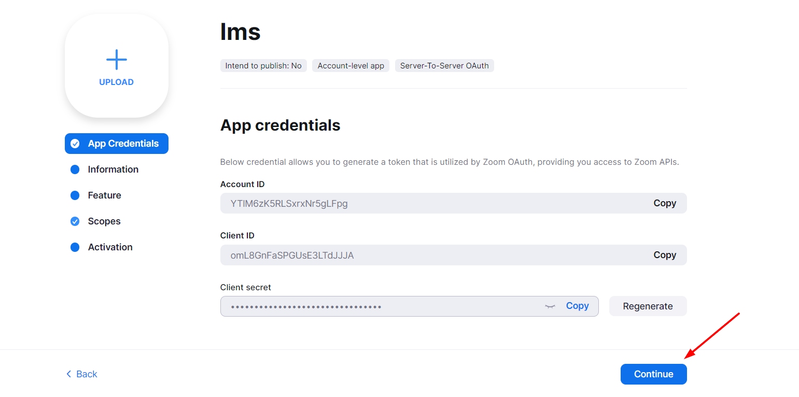
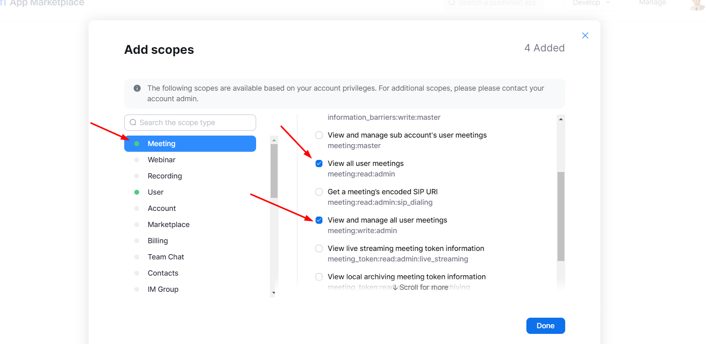

# zoom-laravel

[](https://packagist.org/packages/jubaer/zoom-laravel) [](https://packagist.org/packages/jubaer/zoom-laravel) [](https://packagist.org/packages/jubaer/zoom-laravel) [](https://packagist.org/packages/jubaer/zoom-laravel) [](https://packagist.org/packages/jubaer/zoom-laravel)

The Laravel Zoom API Client is a powerful and comprehensive package designed to provide Laravel users with a unified and consistent approach to integrating Zoom APIs into their applications. With this package, developers can seamlessly interact with Zoom's feature-rich video communication platform, enabling them to create, manage, and enhance their Zoom meetings and webinars effortlessly.

## Installation

You can install the package via composer:

```bash
composer require jubaer/zoom-laravel
```

### Configuration file

Publish the configuration file

```bash
php artisan vendor:publish --provider="Jubaer\Zoom\ZoomServiceProvider"
```

#### then add config/app.php

```php
'providers' => [
    // ...
    Jubaer\Zoom\ZoomServiceProvider::class,
];
```

#### then add config/app.php

```php
'aliases' => [
    // ...
    'Zoom' => Jubaer\Zoom\Facades\Zoom::class,
];
```

This will create a zoom.php config file within your config directory for common user settings:-

```php
return [
    'client_id' => env('ZOOM_CLIENT_KEY'),
    'client_secret' => env('ZOOM_CLIENT_SECRET'),
    'account_id' => env('ZOOM_ACCOUNT_ID'),
    'base_url' => 'https://api.zoom.us/v2/',
];
```

for a user specific user zoom configuration add User model:

```php
    public static function clientID()
    {
        return 'zoom_client_of_user';
    }

    public static function clientSecret()
    {
        return 'zoom_client_secret_of_user';
    }

    public static function accountID()
    {
        return 'zoom_account_id_of_user';
    }
```

### How to get Zoom API credentials

- Go to [https://marketplace.zoom.us/develop/create](https://marketplace.zoom.us/develop/create) and create a Server-to-Server OAuth app
 
- then click on Continue
 
- then fill up the form and click on Continue
 
- then click on Continue
- then click on Add Scopes
 
- then mark all scopes and click on Done
 
- then click on Continue
- then activate your app
- then copy your API Key and API Secret


## Usage

At present we cover the following modules

- Users
- Meetings
- Past Meetings
- Webinars
- Past Webinars
- Recordings
- Past Recordings

## Common get functions

### Create a meeting

```php
    $meetings = Zoom::createMeeting([
                    "agenda" => 'your agenda',
                    "topic" => 'your topic',
                    "type" => 2, // 1 => instant, 2 => scheduled, 3 => recurring with no fixed time, 8 => recurring with fixed time
                    "duration" => 60, // in minutes
                    "timezone" => 'Asia/Dhaka', // set your timezone
                    "password" => 'set your password',
                    "start_time" => 'set your start time', // set your start time
                    "template_id" => 'set your template id', // set your template id  Ex: "Dv4YdINdTk+Z5RToadh5ug==" from https://marketplace.zoom.us/docs/api-reference/zoom-api/meetings/meetingtemplates
                    "pre_schedule" => false,  // set true if you want to create a pre-scheduled meeting
                    "schedule_for" => 'set your schedule for profile email ', // set your schedule for
                    "settings" => [
                        'join_before_host' => false, // if you want to join before host set true otherwise set false
                        'host_video' => false, // if you want to start video when host join set true otherwise set false
                        'participant_video' => false, // if you want to start video when participants join set true otherwise set false
                        'mute_upon_entry' => false, // if you want to mute participants when they join the meeting set true otherwise set false
                        'waiting_room' => false, // if you want to use waiting room for participants set true otherwise set false
                        'audio' => 'both', // values are 'both', 'telephony', 'voip'. default is both.
                        'auto_recording' => 'none', // values are 'none', 'local', 'cloud'. default is none.
                        'approval_type' => 0, // 0 => Automatically Approve, 1 => Manually Approve, 2 => No Registration Required
                    ],

                ]);

```


### Get a meeting

```php
    $meeting = Zoom::getMeeting($meetingId);
```

### Update a meeting

```php
    $meeting = Zoom::updateMeeting($meetingId, [
                    "agenda" => 'your agenda',
                    "topic" => 'your topic',
                    "type" => 2, // 1 => instant, 2 => scheduled, 3 => recurring with no fixed time, 8 => recurring with fixed time
                    "duration" => 60, // in minutes
                    "timezone" => 'Asia/Dhaka', // set your timezone
                    "password" => 'set your password',
                    "start_time" => 'set your start time', // set your start time
                    "template_id" => 'set your template id', // set your template id  Ex: "Dv4YdINdTk+Z5RToadh5ug==" from https://marketplace.zoom.us/docs/api-reference/zoom-api/meetings/meetingtemplates
                    "pre_schedule" => false,  // set true if you want to create a pre-scheduled meeting
                    "schedule_for" => 'set your schedule for profile email ', // set your schedule for
                    "settings" => [
                        'join_before_host' => false, // if you want to join before host set true otherwise set false
                        'host_video' => false, // if you want to start video when host join set true otherwise set false
                        'participant_video' => false, // if you want to start video when participants join set true otherwise set false
                        'mute_upon_entry' => false, // if you want to mute participants when they join the meeting set true otherwise set false
                        'waiting_room' => false, // if you want to use waiting room for participants set true otherwise set false
                        'audio' => 'both', // values are 'both', 'telephony', 'voip'. default is both.
                        'auto_recording' => 'none', // values are 'none', 'local', 'cloud'. default is none.
                        'approval_type' => 0, // 0 => Automatically Approve, 1 => Manually Approve, 2 => No Registration Required
                    ],

                ]);
```

### Delete a meeting

```php
    $meeting = Zoom::deleteMeeting($meetingId);
```

### Get all meetings

```php
    $meetings = Zoom::getAllMeeting();
```

### Get a meeting

```php
    $meeting = Zoom::getMeeting($meetingId);
```

### Get all upcoming meetings

```php
    $meetings = Zoom::getUpcomingMeeting();
```

### Get all past meetings

```php
    $meetings = Zoom::getPreviousMeetings();
```

### reschedule meeting

```php
    $meetings = Zoom::rescheduleMeeting($meetingId, [
                    "agenda" => 'your agenda',
                    "topic" => 'your topic',
                    "type" => 2, // 1 => instant, 2 => scheduled, 3 => recurring with no fixed time, 8 => recurring with fixed time
                    "duration" => 60, // in minutes
                    "timezone" => 'Asia/Dhaka', // set your timezone
                    "password" => 'set your password',
                    "start_time" => 'set your start time', // set your start time
                    "template_id" => 'set your template id', // set your template id  Ex: "Dv4YdINdTk+Z5RToadh5ug==" from https://marketplace.zoom.us/docs/api-reference/zoom-api/meetings/meetingtemplates
                    "pre_schedule" => false,  // set true if you want to create a pre-scheduled meeting
                    "schedule_for" => 'set your schedule for profile email ', // set your schedule for
                    "settings" => [
                        'join_before_host' => false, // if you want to join before host set true otherwise set false
                        'host_video' => false, // if you want to start video when host join set true otherwise set false
                        'participant_video' => false, // if you want to start video when participants join set true otherwise set false
                        'mute_upon_entry' => false, // if you want to mute participants when they join the meeting set true otherwise set false
                        'waiting_room' => false, // if you want to use waiting room for participants set true otherwise set false
                        'audio' => 'both', // values are 'both', 'telephony', 'voip'. default is both.
                        'auto_recording' => 'none', // values are 'none', 'local', 'cloud'. default is none.
                        'approval_type' => 0, // 0 => Automatically Approve, 1 => Manually Approve, 2 => No Registration Required
                    ],

                ]);
```

### end meeting

```php
    $meetings = Zoom::endMeeting($meetingId);
```

### delete meeting

```php
    $meetings = Zoom::deleteMeeting($meetingId);
```

### recover meeting

```php
    $meetings = Zoom::recoverMeeting($meetingId);
```


### Get all users

```php
    $users = Zoom::getUsers(['status' => 'active']); // values are 'active', 'inactive', 'pending'. default is active. and you can pass page_size and page_number as well
```


### Changelog

Please see [CHANGELOG](CHANGELOG.md) for more information what has changed recently.


### Security

If you discover any security related issues, please email jubaer01.cse@gmail.com instead of using the issue tracker.

## Credits

- [Jubaer Hossain](https://github.com/JubaerHossain)

## License

The MIT License (MIT). Please see [License File](LICENSE.md) for more information.
